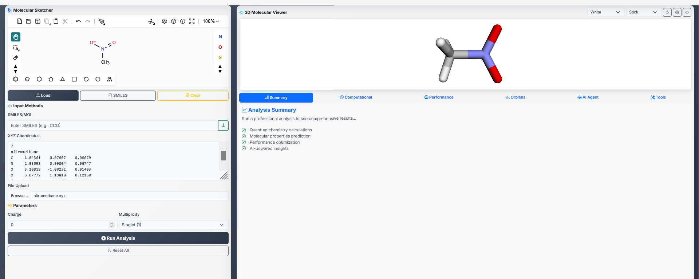
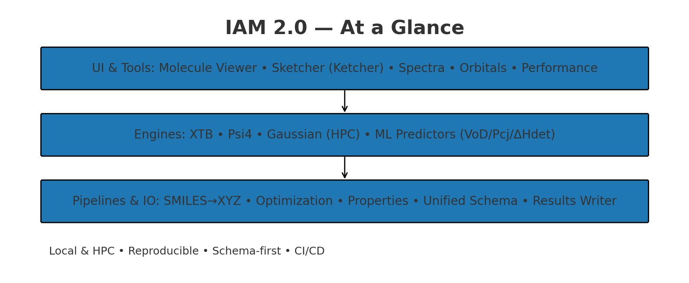

## Quick Start: Environment Setup

> **Note:** The `iam2` conda environment is now set to auto-activate for all new terminal sessions via your `~/.bashrc` file. You do not need to manually activate it each time.

```sh
# Create and activate the IAM2 environment (recommended)
mamba create -n iam2 -f chem-env.yaml   # or: conda env create -f chem-env.yaml
conda activate iam2
make verify    # Check required packages
make run       # Start backend API
```

# IAM 2.0 — Intelligent Agent for Molecules




**Model. Simulate. Predict. Visualize.**  
A clean, modular platform for computational chemistry with a focus on energetic materials — built for local devices and HPC.

- ⚙️ Engines: XTB (local), Psi4 (local), Gaussian-ready (HPC)
- 📈 Predictors: Kamlet–Jacobs, Keshavarz, ML (VoD/Pcj/ΔHdet)
- 🧪 Pipelines: SMILES→XYZ→Optimization→Properties→Prediction
- 🖥️ UI: Molecule viewer, Orbitals, Spectra, Performance
- 🧰 Dev: FastAPI, Pydantic, RDKit, 3Dmol.js, GitHub Actions

📘 Read the full whitepaper: **[`/docs/IAM_2.0_Whitepaper.md`](docs/IAM_2.0_Whitepaper.md)**

## Repository layout

IAM-2.0/
  api/
    __init__.py
    xtb_routes.py
    psi4_routes.py
    empirical_routes.py
    cj_routes.py
  docs/
    API.md
    README_UI.md
    dev_notes.md
  iam/
    __init__.py
    backend/
      __init__.py
      utils/
        __init__.py
        persistence.py
    core/
      __init__.py
      empirical/
        __init__.py
        predictors.py
    runners/
      __init__.py
      xtb.py
      psi4.py
      empirical.py
      cj.py
  installers/
    Miniconda3-latest-Linux-x86_64.sh
  scripts/
    __init__.py
    verify_env.py
    README.md
  tests/
    __init__.py
    api/
      test_routes.py
    core/
      test_empirical.py
    runners/
      test_cj.py
    utils/
      test_persistence.py
  REPORTS/
  .copilot-instructions.md
  .gitignore
  chem-env.yaml
  Makefile
  README.md
  pyproject.toml
  Dockerfile
  docker-compose.yml
