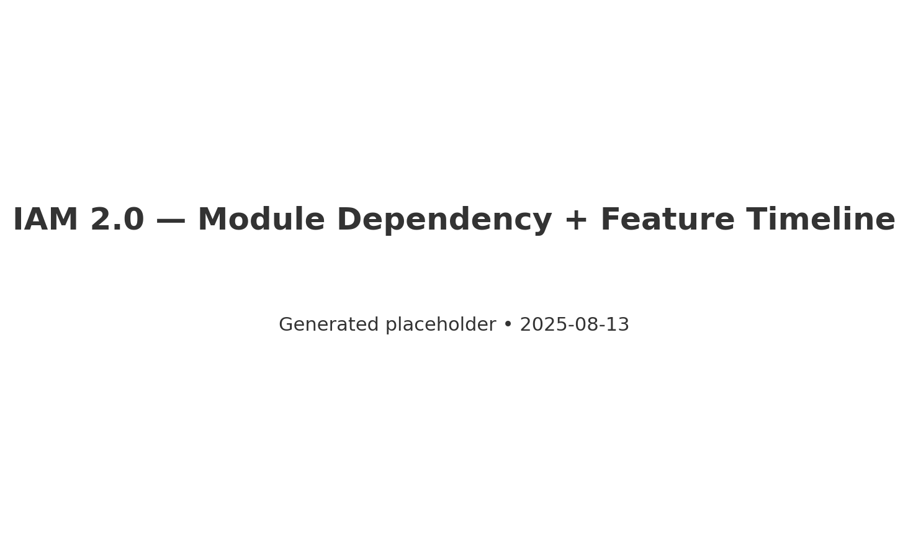
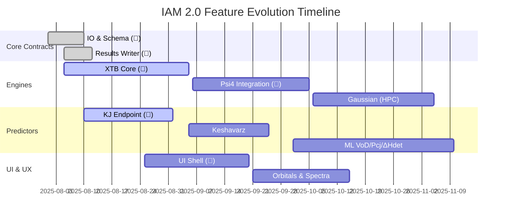
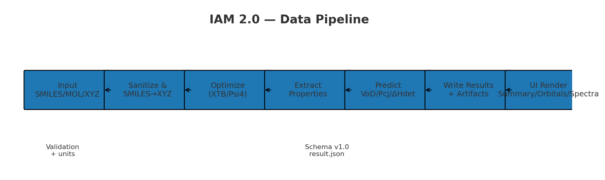
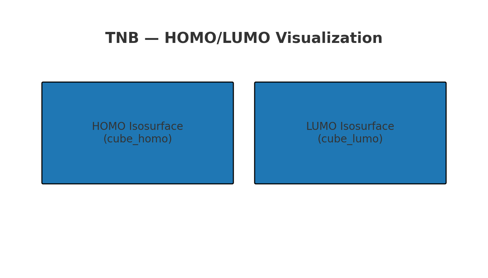

# IAM – Master Technical Report (v2.0 Whitepaper)
*Status:* Public Release — August 2025  
*Last updated:* 2025-08-13

> Extended, presentation-ready whitepaper for IAM 2.0. Includes visuals, rationale, case studies, feature timeline, and legacy appendix.

---

## Cover Visual — Architecture + Delivery Timeline




> **💡 Developer Note:** The PNG ensures readable visuals on GitHub. Update the Mermaid code as dates shift; regenerate PNGs later if desired.

---

## 1. Executive Summary

IAM 2.0 is a schema‑first, engine‑agnostic, UI‑centric platform that unifies molecular simulation, prediction, and visualization behind one stable API, built for both local devices and HPC environments.

### 1.1 IAM at a Glance


- Core: FastAPI, Pydantic v2, RDKit, 3Dmol.js
- Engines: XTB, Psi4 (local), Gaussian-ready (HPC)
- Predictors: Kamlet–Jacobs, Keshavarz, ML models (VoD/Pcj/ΔHdet)
- UI: Tabs for Summary / Output / Orbitals / Spectra / Performance
- Artifacts: Logs, spectra (JSON/CSV), cube files for HOMO/LUMO
- DevOps: CI (ruff, mypy, pytest), pre‑commit, schema checks

---

## 2. System Overview

### 2.1 Architecture (Mermaid)
```mermaid
flowchart LR
  subgraph API[API Layer]
    A1[/FastAPI/]
  end
  subgraph IO[IO & Schema]
    I1[Schema (Pydantic)]
    I2[Results Writer]
    I3[File Utils]
  end
    subgraph ENG[Engines]
    E1[XTB]
    E2[Psi4]
    E3[Gaussian (HPC Stub)]
  end
  subgraph PIPE[Pipelines]
    P1[SMILES→XYZ]
    P2[OPT→PROP]
    P3[Predictor Flow]
  end
  subgraph PRED[Predictors]
    R1[Kamlet–Jacobs]
    R2[Keshavarz]
    R3[ML Predictors]
  end
  subgraph UI[UI Layer]
    U1[Viewer + Tabs]
    U2[Ketcher]
  end
  A1 --> I1
  A1 --> I2
  A1 --> P1
  P1 --> E1
  P2 --> E1
  P2 --> E2
  P3 --> R1
  P3 --> R2
  P3 --> R3
  I2 --> U1
  A1 --> U1
  U2 --> A1
  classDef api fill:#FFF3B0,stroke:#E0B600,stroke-width:1px;
  classDef eng fill:#C2F970,stroke:#3D9B00,stroke-width:1px;
  classDef pred fill:#FFC78E,stroke:#C56700,stroke-width:1px;
  classDef io fill:#D0B3FF,stroke:#6C2CF1,stroke-width:1px;
  classDef ui fill:#BDE0FE,stroke:#2776C9,stroke-width:1px;
  class A1 api;
  class E1,E2,E3 eng;
  class R1,R2,R3 pred;
  class I1,I2,I3 io;
  class U1,U2 ui;
```

### 2.2 Data Pipeline


> **💡 Developer Note:** All numeric metrics must include explicit unit strings; the UI reads them to label axes.

---

## 3. Module Specifications (Expanded)

- **[Spec-ID: IO.1]** Unified Results Schema — typed, unit‑aware outputs with artifact paths.  
- **[Spec-ID: IO.2]** Results Writer — immutable run folders with `result.json` + `provenance.json`.  
- **[Spec-ID: ENG.XTB]** XTB wrapper (opt/sp/freq, cubes, timeouts).  
- **[Spec-ID: ENG.PSI4]** Psi4 (sp/opt/freq + spectra JSON).  
- **[Spec-ID: ENG.GAUS]** Gaussian HPC stub (input generation + remote queue).  
- **[Spec-ID: PIPE.SMILES]** RDKit ETKDG + UFF/MMFF; XYZ validator.  
- **[Spec-ID: PIPE.OPT]** Cache converged geometry; job hashing.  
- **[Spec-ID: PIPE.PRED]** Orchestrate properties → predictors with unit normalization.  
- **[Spec-ID: PRED.KJ]** Kamlet–Jacobs (VoD, Pcj).  
- **[Spec-ID: PRED.KESH]** Keshavarz correlations (domain limits).  
- **[Spec-ID: PRED.ML]** ML VoD/Pcj/ΔHdet (RF/GPR/XGBoost) with registry + dataset hash.  
- **[Spec-ID: UI.SHELL]** Tabs: Summary, Output, Orbitals, Spectra, Performance.  
- **[Spec-ID: UI.KETCH]** Ketcher integration (postMessage bridge).  
- **[Spec-ID: UI.SPEC]** Spectra viewers with CSV export.

---

## 4. API Overview (with examples)

- `POST /api/v1/run_xtb` — run XTB (opt/sp/freq)  
- `POST /api/v1/run_psi4` — run Psi4 (sp/opt/freq)  
- `POST /api/v1/predict_vod` — VoD/Pcj/ΔHdet from properties  
- `POST /api/v1/jobs` / `GET /api/v1/jobs/{id}` — queue & poll long jobs  

**Error Envelope (standard)**
```json
{ "code": 400, "message": "Invalid input", "details": {}, "correlation_id": "uuid" }
```

---

## 5. Case Studies

### 5.1 CL‑20 — VoD Prediction
Workflow: XTB opt → property extraction → KJ + ML predictor → compare outputs.  


> **💡 Developer Note:** CL‑20 stresses both geometry generation and descriptor ranges; keep model extrapolation warnings visible.

### 5.2 ADN — Stability Predictor
Workflow: RDKit/SMARTS functional group scan → hydrolysis flags → recommended stabilizers.

### 5.3 TNB — HOMO–LUMO Visualization
Workflow: XTB opt → cube files → 3Dmol surfaces.  


---

## 6. Feature & Module Backlog (Grouped)
(See FINAL spec for acceptance criteria; 🔑 = critical path.)

- Engines: XTB (🔑), Psi4 (🔑), Gaussian (HPC), Vibrations, Stability Predictor …  
- Predictors: KJ (🔑), Keshavarz, ML VoD/Pcj/ΔHdet, Ensemble …  
- Data/Knowledge: PDF→JSON, IAM_Knowledge DB, dataset versioning …  
- UI/UX: Shell tabs (🔑), Batch analysis, Inline error highlights …  
- System: Results writer (done), IAM_Agent, Offline Pi mode …  
- QoL: Export ZIP, Autosave, Similarity search, Plugins …  
- Long‑Term: Web3 node, RBAC, Real‑time collaboration …

---

## 7. Roadmap & Milestones
- **Alpha (M1–M2):** Contracts, XTB, Psi4, UI Shell, Orbitals  
- **Beta (M3–M4):** Predictors (KJ/Kesh/ML), Spectra, Pipelines  
- **Release (M5–M6):** Gaussian HPC connector, quotas/security/observability

---

## 8. Migration Guide — IAM 1.x → 2.0
- Kept: SMILES→XYZ approach, core parsing ideas, KJ base  
- Rebuilt: API (FastAPI), schema & writer, UI shell, predictor flow  
- Dropped: Legacy Flask templates, brittle Gaussian hacks

---

## 9. Next Major Milestones
- **v2.1** — Psi4 frequency + spectra viewers; UI polish  
- **v2.2** — ML predictor (VoD/Pcj/ΔHdet) + registry  
- **v2.3** — Gaussian HPC connector + remote queue  
- **v3.0 (vision)** — Knowledge base, plugin system, collaboration

---

## Appendix A — Nox Project Archive (IAM 1.x)
> Legacy features with v2.0 status tags.

- ✅ Unified Results Schema — Implemented as IO.1  
- ✅ Results Writer — Implemented as IO.2  
- 🔄 Psi4 Integration — Planned (M2)  
- 🔄 Gaussian HPC — Planned (M5)  
- ❌ Legacy Flask Templates — Dropped (replaced by UI shell)  
- 🔄 PDF→JSON Extractor — Planned (data/knowledge)

---

## How to Contribute
See `CONTRIBUTING.md` in the repo root for setup, coding standards, and PR process.
