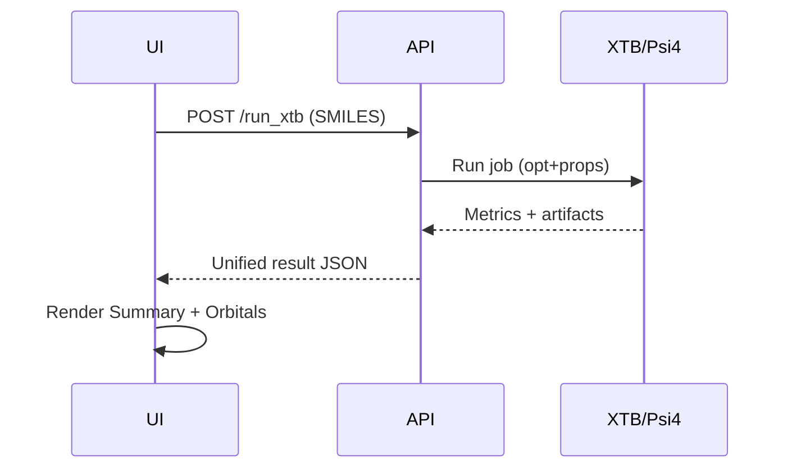

# IAM 2.0 — Master Technical Report & Requirements (FINAL)
*Last updated: 2025-08-13*

> **Audience:** developers, collaborators, and tooling (e.g., GitHub Copilot).  
> **Document role:** single source of truth for IAM 2.0 — architecture, specs, backlog, roadmap, migration, and standards.

---

## 0. Quick Start

### 0.1 Clone
```bash
git clone https://github.com/<your-org>/IAM-2.0.git
cd IAM-2.0
```

### 0.2 Environment
**Conda (recommended)**
```bash
conda env create -f chem-env.yaml
conda activate chem-env
```

**pip/venv**
```bash
python -m venv venv
source venv/bin/activate  # Linux/Mac
venv\Scripts\activate   # Windows
pip install -r requirements.txt
```

### 0.3 Configure
```bash
cp .env.example .env
# Set engine paths etc.
# XTB_PATH=/usr/local/bin/xtb
# PSI4_PATH=/opt/psi4/bin/psi4
# UI_CORS_DOMAIN=http://localhost:3000
# MAX_FILE_SIZE_MB=20
# MAX_JOBS=4
```

> **Developer Note:** Ensure `xtb`/`psi4` are on PATH or set explicit paths in `.env`.

### 0.4 Run API (dev)
```bash
uvicorn api.main:app --host 0.0.0.0 --port 8000 --reload
```
Health check: `http://localhost:8000/api/v1/health`

### 0.5 Run tests
```bash
pytest -q
```

### 0.6 First calculation (example)
- Submit SMILES `CCO` (ethanol) to `/api/v1/run_xtb` with `opt=true`.
- Open Orbitals tab to view HOMO/LUMO cubes when available.

---

## 1. Executive Summary

IAM 2.0 is a **clean, modular rebuild** of the Intelligent Agent for Molecules — a platform to **simulate, predict, and visualize** molecular properties with a focus on energetic materials, while remaining extensible to broader chemistry domains. The 2.0 architecture is **schema-first**, **engine-agnostic**, and **UI-friendly**, enabling local (e.g., Raspberry Pi) and HPC workflows with the same API.

### 1.1 At a Glance
| Capability | Module | Purpose | Status | Notes |
|---|---|---|---|---|
| Geometry & Properties | `engines/xtb.py` | XTB GFNx2 opt/sp/freq, dipole, gap, cubes | Partial | Unified schema; timeout & artifacts planned |
| DFT Engine | `engines/psi4.py` | Psi4 SP/OPT/FREQ + spectra | Planned | API & artifacts unified with XTB |
| HPC Connector | `engines/gaussian_stub.py` | Gaussian input/remote queue | Planned | Remote execution only |
| Predictors | `predictors/` | Kamlet–Jacobs, Keshavarz, ML (VoD/Pcj/ΔHdet) | Partial | Unified inputs/units |
| Pipelines | `pipelines/` | SMILES→XYZ→OPT→PROP→Predict | Planned | Caching + job hashing |
| UI Shell | `ui/` | Tabs: Summary/Output/Orbitals/Spectra/Performance | Planned | 3Dmol & Ketcher |
| Results Schema | `io/schema.py` | Canonical results + units + artifacts | ✅ | Contract for all modules |
| Results Writer | `io/results_writer.py` | Immutable run folders + provenance | ✅ | Returns artifact paths |
| CI & Standards | `.github/workflows`, `CONTRIBUTING.md` | Lint, type, tests | ✅ | Blocks regressions |

> **Impact:** IAM 2.0 eliminates legacy fragility and makes results portable across engines and environments using one contract.

---

## 2. System Overview

IAM 2.0 consists of an **API layer**, **engines**, **pipelines**, **predictors**, **IO**, **UI**, and **DevOps tooling**. All outputs conform to a **unified results schema** with explicit units and artifact paths.

### 2.1 Module Dependency Map (Mermaid)
```mermaid
flowchart LR
  subgraph API[API Layer]
    A1[/FastAPI/]
  end

  subgraph IO[IO & Schema]
    I1[Schema (Pydantic)]
    I2[Results Writer]
    I3[File Utils]
  end

  subgraph ENG[Engines]
    E1[XTB]
    E2[Psi4]
    E3[Gaussian (Stub)]
  end

  subgraph PIPE[Pipelines]
    P1[SMILES→XYZ]
    P2[OPT→PROP]
    P3[Predictor Flow]
  end

  subgraph PRED[Predictors]
    R1[Kamlet–Jacobs]
    R2[Keshavarz]
    R3[ML Predictors]
  end

  subgraph UI[UI Layer]
    U1[Viewer + Tabs]
    U2[Ketcher]
  end

  A1 --> I1
  A1 --> I2
  A1 --> P1
  P1 --> E1
  P2 --> E1
  P2 --> E2
  P3 --> R1
  P3 --> R2
  P3 --> R3
  I2 --> U1
  A1 --> U1
  U2 --> A1

  classDef api fill:#FFF3B0,stroke:#E0B600,stroke-width:1px;
  classDef eng fill:#C2F970,stroke:#3D9B00,stroke-width:1px;
  classDef pred fill:#FFC78E,stroke:#C56700,stroke-width:1px;
  classDef io fill:#D0B3FF,stroke:#6C2CF1,stroke-width:1px;
  classDef ui fill:#BDE0FE,stroke:#2776C9,stroke-width:1px;
  class A1 api;
  class E1,E2,E3 eng;
  class R1,R2,R3 pred;
  class I1,I2,I3 io;
  class U1,U2 ui;
```

> **Developer Note:** Keep Mermaid code in the doc. Add a rendered PNG at `docs/images/module_map.png` for static viewing:
> ``

### 2.2 Technology Stack
- **Python 3.10+**, FastAPI, Pydantic v2
- **RDKit** for SMILES/MOL→3D (ETKDG + UFF/MMFF)
- **XTB**, **Psi4** (local); **Gaussian** (HPC via stub/connector)
- **3Dmol.js** viewer, **Ketcher** sketcher
- **pytest**, **ruff**, **mypy**; GitHub Actions CI

---

## 3. Module Specifications

> Each spec has **Acceptance Criteria (AC)** for implementation & testing.

### 3.1 IO & Schema (`io/`)

**3.1.1 Unified Results Schema — `[Spec-ID: IO.1]`**
- Keys: `molecule_id`, `source`, `inputs`, `metrics`, `units`, `artifacts`, `created_at`, `schema_version`
- Inputs include `{type: smiles|mol|xyz, data, charge, multiplicity, options}`
- Units present for **every** numeric metric
- Artifacts: `log`, optional `cube_homo`, `cube_lumo`, spectra files

**AC**
- [ ] Pydantic models validate all responses
- [ ] Schema version pinned and emitted in `result.json`
- [ ] Fails validation if any metric lacks a unit

**3.1.2 Results Writer — `[Spec-ID: IO.2]`**
- Creates `runs/<slug>/<timestamp>/`
- Writes `result.json` + `provenance.json`
- Returns artifact paths for UI

**AC**
- [ ] Immutable folder per run
- [ ] Provenance includes engine versions, wall time

> **Developer Note:** Use slugified `molecule_id` to avoid unsafe paths.

---

### 3.2 Engines (`engines/`)

**3.2.1 XTB Wrapper — `[Spec-ID: ENG.XTB]`**
- Modes: `opt`, `sp`, `freq`
- Metrics: total energy, HOMO-LUMO gap, dipole (vector+total)
- Artifacts: `xtb.log`, optional `*.cube` (HOMO/LUMO)

**AC**
- [ ] Timeout & process tree kill
- [ ] Env detection via `XTB_PATH` or PATH
- [ ] Unified results schema with units (eV, Debye)

**3.2.2 Psi4 Wrapper — `[Spec-ID: ENG.PSI4]`**
- SP/OPT/FREQ; method/basis configurable
- Spectra for `freq` jobs (IR; Raman optional)

**AC**
- [ ] Outputs merged to unified schema
- [ ] Spectra JSON written & linked in artifacts

**3.2.3 Gaussian Stub (HPC) — `[Spec-ID: ENG.GAUS]`**
- Generate Gaussian input files
- Queue submission via connector (remote only)

**AC**
- [ ] No local execution
- [ ] Secure job packaging & artifact retrieval plan

---

### 3.3 Pipelines (`pipelines/`)

**3.3.1 SMILES→XYZ — `[Spec-ID: PIPE.SMILES]`**
- RDKit ETKDG + UFF/MMFF optimization
- XYZ validator

**AC**
- [ ] Invalid SMILES/MOL returns error envelope
- [ ] XYZ count and geometry check pass

**3.3.2 OPT→PROP — `[Spec-ID: PIPE.OPT]`**
- Reuse converged geometry for properties
- Caching via job hash

**AC**
- [ ] Cache hit bypasses duplicate compute
- [ ] Results equivalent on rerun (tolerance defined)

**3.3.3 Predictor Flow — `[Spec-ID: PIPE.PRED]`**
- Chain engine metrics → predictors → performance panel

**AC**
- [ ] Units normalized before prediction
- [ ] Prediction outputs include uncertainty when available

---

### 3.4 Predictors (`predictors/`)

**3.4.1 Kamlet–Jacobs — `[Spec-ID: PRED.KJ]`**
- VoD, Pcj from density and Q (heat of detonation)

**AC**
- [ ] Units: VoD (m/s), Pcj (GPa) normalized
- [ ] Constants documented

**3.4.2 Keshavarz — `[Spec-ID: PRED.KESH]`**
- Adjusted correlations for CHNOFCl & B–N materials

**AC**
- [ ] Domain limits documented
- [ ] Input validation for required fields

**3.4.3 ML Predictors — `[Spec-ID: PRED.ML]`**
- Features: composition, OB, density, ΔHf, RDKit descriptors
- Models: RF/GPR/XGBoost (configurable)

**AC**
- [ ] LOOCV flag; metrics: R², MAE, RMSE
- [ ] Model registry entry with hash + training set

> **Developer Note:** Keep dataset versions immutable; models must record dataset hash.

---

### 3.5 UI (`ui/`)

**3.5.1 UI Shell — `[Spec-ID: UI.SHELL]`**
- Tabs: Summary, Output, Orbitals, Spectra, Performance
- Error toast shows `correlation_id`

**AC**
- [ ] Lazy-load cubes in Orbitals
- [ ] Copy-to-clipboard in Output (logs)

**3.5.2 Ketcher Integration — `[Spec-ID: UI.KETCH]`**
- Draw/upload → submit to API

**AC**
- [ ] postMessage bridge tested
- [ ] Invalid MOL sanitization path documented

**3.5.3 Spectra Viewers — `[Spec-ID: UI.SPEC]`**
- IR/Raman/UV-Vis/NMR from JSON

**AC**
- [ ] CSV download
- [ ] Axes & units labeled

> 

---

## 4. API & Endpoint Overview

**Error Envelope (standard)**
```json
{ "code": 400, "message": "Invalid input", "details": {}, "correlation_id": "uuid" }
```

### 4.1 `POST /api/v1/run_xtb` — `[API: XTBRUN]`
**Request**
```json
{
  "input_type": "smiles",
  "input_data": "CCO",
  "charge": 0,
  "multiplicity": 1,
  "gfn": 2,
  "options": {"opt": true, "property": true}
}
```
**Response**
```json
{
  "schema_version": "1.0",
  "molecule_id": "ethanol_2025-08-13T15-00-00",
  "source": "xtb",
  "inputs": { "...": "..." },
  "metrics": {"total_energy_ev": -40.12, "homo_lumo_gap_ev": 6.54, "dipole_total_debye": 1.23},
  "units": {"total_energy_ev": "eV", "homo_lumo_gap_ev": "eV", "dipole_total_debye": "D"},
  "artifacts": {"cube_homo": "runs/.../homo.cube", "cube_lumo": "runs/.../lumo.cube", "log": "runs/.../xtb.log"},
  "created_at": "2025-08-13T19:00:00Z"
}
```

**curl**
```bash
curl -X POST http://localhost:8000/api/v1/run_xtb  -H "Content-Type: application/json"  -d '{"input_type":"smiles","input_data":"CCO","charge":0,"multiplicity":1,"gfn":2,"options":{"opt":true,"property":true}}'
```

### 4.2 `POST /api/v1/run_psi4` — `[API: PSI4RUN]`
- Inputs: same + `method`, `basis`, `calc="sp|opt|freq"`
- Outputs: unified schema; `freq` adds spectra artifact(s).

### 4.3 `POST /api/v1/predict_vod` — `[API: VOD]`
- Inputs: `{formula, density, heat_of_formation_kjmol}`
- Outputs: `{kamlet_jacobs, ml_model}` blocks with units

### 4.4 `POST /api/v1/jobs` / `GET /api/v1/jobs/{id}` — `[API: JOBS]`
- Submit long-running jobs; poll status & results

> **Developer Note:** Enforce `MAX_FILE_SIZE_MB` & per-user `MAX_JOBS` here.

---

## 5. Feature & Module Backlog (Grouped) — **Everything requested**

> 🔑 = Critical Path

### 5.1 Engine & Computation
- 🔑 **XTB Core** — unify schema, timeout, artifacts (**Status:** In progress)  
- 🔑 **Psi4 Integration** — SP/OPT/FREQ, spectra JSON (**Status:** Planned)  
- **Gaussian (HPC)** — input gen + remote queue (**Status:** Planned)  
- **Vibration Animations** — normal mode visualization (**Status:** Planned)  
- **Stability Predictor** — SMARTS-based hydrolysis/oxidation flags (**Status:** Planned)

### 5.2 Predictors
- 🔑 **KJ Endpoint** — units, constants, validation (**Status:** In progress)  
- **Keshavarz Correlations** — CHNOFCl & B–N (**Status:** Planned)  
- **ML VoD/Pcj/ΔHdet** — registry + uncertainty (**Status:** Planned)  
- **Ensemble** — stacking with confidence bands (**Status:** Deferred)

### 5.3 Data Extraction & Knowledge
- **PDF → JSON Molecule Sheets** (Klapötke/LLNL/Agrawal) (**Status:** Deferred)  
- **IAM_Knowledge DB** — properties + provenance (**Status:** Planned)  
- **Dataset Auto-Versioning & Diff** (**Status:** Planned)

### 5.4 UI/UX
- 🔑 **UI Shell Tabs** — Summary/Output/Orbitals/Spectra/Performance (**Status:** Planned)  
- **Batch Analysis** — queue multi-molecule jobs (**Status:** Deferred)  
- **Inline Error Highlights** (**Status:** Planned)

### 5.5 System Integration
- 🔑 **Results Writer & Schema Everywhere** (**Status:** Done)  
- **IAM_Agent** — background watcher (**Status:** Deferred)  
- **Offline Pi Mode** (**Status:** Planned)

### 5.6 Quality of Life
- **Export Job ZIP** (inputs/outputs/logs) (**Status:** Planned)  
- **Autosave to IAM_Knowledge/Results** (**Status:** Planned)  
- **Molecule Similarity Search** (**Status:** Deferred)  
- **Plugin Architecture** (**Status:** Deferred)

### 5.7 Long-Term / Experimental
- **Web 3.0 IAM Node** (**Status:** Deferred)  
- **Multi-user RBAC** (**Status:** Deferred)  
- **Real-time Collaborative Editing** (**Status:** Deferred)

Each backlog item will be tracked as a GitHub issue referencing this section (see §10).

---

## 6. Roadmap & Milestones

### Milestones (proposed)
- **M1 – Core Contracts & XTB (🔑)**  
  IO.1, IO.2, ENG.XTB, UI.SHELL (skeleton), API: XTBRUN
- **M2 – Psi4 & Orbitals (🔑)**  
  ENG.PSI4, UI.Orbitals, API: PSI4RUN
- **M3 – Predictors**  
  PRED.KJ, PRED.KESH, PRED.ML, API: VOD
- **M4 – Spectra & Pipelines**  
  PIPE.SMILES, PIPE.OPT, UI.Spectra
- **M5 – HPC Connector (Gaussian)**  
  ENG.GAUS + remote queue
- **M6 – Security, Quotas, Observability**  
  CORS, size/time quotas, metrics

**Acceptance Criteria per Milestone**
- Passing CI (lint/type/tests)
- API examples validated against schema
- Docs updated (this file + API.md)

---

## 7. Migration Guide (IAM 1.x → 2.0)

- **Kept:** SMILES→XYZ logic, selected XTB parsing, KJ predictor foundations  
- **Rebuilt:** API layer (FastAPI), UI shell, schema & writer, job orchestration  
- **Dropped:** Legacy Flask templates, partial Gaussian solvents, brittle hacks  

**Checklist**
- [ ] Port `xtb` wrapper → ENG.XTB AC satisfied  
- [ ] Replace ad-hoc JSON with schema writer IO.2  
- [ ] UI tabs wired to new endpoints  
- [ ] Update any scripts to use `/api/v1/*` routes

---

## 8. Technical Standards & CI/CD

- **Pre-commit:** ruff (lint/format), mypy (basic), unit tests required  
- **CI:** run lint/type/tests + schema conformance checks  
- **Contracts:** unified results schema + error envelope **mandatory**  
- **Security:** CORS limited to UI domain; reject files > `MAX_FILE_SIZE_MB`; enforce `MAX_JOBS`

> **Developer Note:** Add Prometheus counters (jobs_started/failed, durations) when feasible.

---

## 9. Version History (high-level)
- **2024–2025:** IAM 1.x prototypes, partial XTB, fragile outputs  
- **2025-08:** IAM 2.0 architecture defined; schema & writer implemented; new repo initialized  
- **Next:** Engines → Predictors → Pipelines → HPC → Security/Quotas

---

## 10. Copilot Integration Notes

### 10.1 Parsing Rules
- Section IDs appear as **`[Spec-ID: ...]`** and **`[API: ...]`**.  
- Backlog in §5 is the feature source-of-truth; open **one issue per bullet**.

### 10.2 Issue Template Mapping
Use repository templates and reference:  
`docs/IAM_Master_Technical_Report_FINAL.md §<section or Spec-ID>`

**Example title:**  
`[Engine] Implement XTB Wrapper (ref: FINAL.md §3.2 / [Spec-ID: ENG.XTB])`

**Acceptance criteria to copy:** Use AC blocks from each spec.

### 10.3 Milestone Tagging
- Map issues to milestones in §6 by module: XTB→M1, Psi4→M2, Predictors→M3, etc.

### 10.4 PR Guidance
- Include tests and update examples in API.md.  
- Ensure units present for all metrics; return standard error envelope on failures.

---

## Appendix A — Example Error Envelopes

**Invalid SMILES**
```json
{"code":400,"message":"Invalid SMILES","details":{"field":"input_data"},"correlation_id":"uuid"}
```

**Engine Timeout**
```json
{"code":504,"message":"Engine timeout","details":{"engine":"xtb","timeout_s":300},"correlation_id":"uuid"}
```

**Quota Exceeded**
```json
{"code":429,"message":"Quota exceeded","details":{"limit":"MAX_JOBS"},"correlation_id":"uuid"}
```

---

## Appendix B — Example UI Flow (Mermaid)
